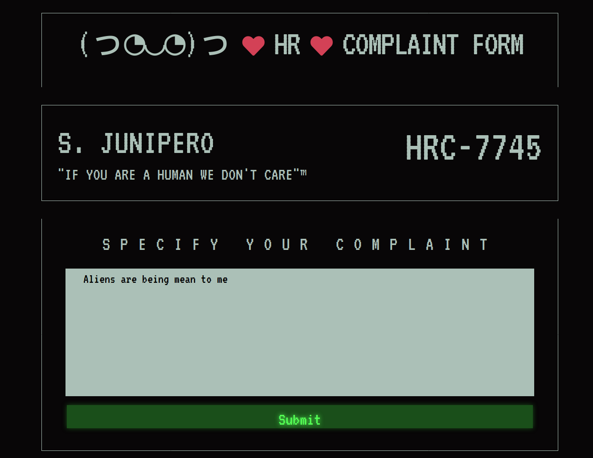

# Alien Complaint Form

This was a challenge in the Web category during the Cyber Apocalypse 2021 CTF.

> The Aliens found a cool new security feature called CSP and have since  implemented it into their HR Complaint Form. There are reports that any  issues reported by humans are not taken into account and instead  deleted. The Human resistance has left a backdoor in the website that  can be used to acquire sensitive information from the Aliens. Can you  find it?


The challenge required you to retrieve the flag from the cookies of a headless (automated) browser that performed some maintenance on the feedback sent via the complaint form. Getting the flag is achieved by using a combination of [XSS](https://owasp.org/www-community/attacks/xss/) and a query string parameter, while being limited by [CSP](https://developer.mozilla.org/en-US/docs/Web/HTTP/CSP) restrictions.

Besides hosting the website as a Docker instance, the CTF also provided the source of the website. 

First, let's look at the website. Accessing the complaint form website shows, not surprisingly, a complaint form:



Submitting the form sent the data in JSON format to `/api/submit`:


Where does the complaint end up? Let's take a look at the source of the website:


It seems we're dealing with a Node.js-based backend. 

Looking at the code for `/api/submit`, where we sent our complaint to, one thing stands out:


It seems that the bot is triggered immediately to purge any feedback sent in by Humans.

Let's take a look at the bot's code:


Here we see that the flag is stored in the bot's cookies (of course, the downloadable source didn't include the actual flag). So, how does the bot purge Human feedback?

1. It accesses `/list`
2. It runs a database migration, which simply deletes all the tables in the database and rebuilds everything

We can ignore the database migration as it is out of our hands. But since the bot accesses `/list` it is probably shown our submission. That would be an excellent place for exploitation.

We cannot access `/list` ourselves because its access restricted to 127.0.0.1 But no matter, we have the source. In the template for `/list` we don't see that the complaints are being rendered. Instead, the only interesting thing is a reference to a `list.js`


The contents of `list.js`:


That's how the complaints are retrieved: via [JSONP](https://en.wikipedia.org/wiki/JSONP). Another API endpoint, `/api/jsonp` is called and in the end the `display()` function renders each complaint to the page.

Looking at how `display()` works, we can see that the complaint text is not being escaped. That means that we can submit HTML via the complaint form and that it will be displayed as-is to the bot. A classic case of [XSS](https://owasp.org/www-community/attacks/xss/).

Normally, this would be the end: having a way to perform XSS would be enough to send the cookies to some URL where we could read them. However, there are two things that complicate it for us.

One, the Aliens, wisely enough, made sure to add a [Content Security Policy](https://developer.mozilla.org/en-US/docs/Web/HTTP/CSP) to the `list.html` page to prevent browsers from accessing any remote system:


Two, because the complaints are written to the page via `innerHTML`, any `<script>` tag that we insert won't be executed. Another [security precaution](https://developer.mozilla.org/en-US/docs/Web/API/Element/innerHTML#security_considerations) that browsers have. 

So we need a different way to execute JavaScript and to get the cookies from the bot's browser into our hands. Back to the code then.

Looking further at the code in `list.js` we also notice one thing: `display()`, the XSS-vulnerable function, isn't called anywhere.

Instead of calling `display()` directly, `/api/jsonp` calls it and that is because of the way JSONP works. A JSONP endpoint has to include a bit of JavaScript to not cause parsing errors, and to get its JSON data into a variable or function somewhere so it can be used in the page asking for it.

Looking at the source for `/api/jsonp` we see how `display()` is called:


If no `callback` query string parameter is given, it prefixes all the complaint data with `display`. Meaning that `display()` is executed at `/list` when the JSONP endpoint is retrieved.

However, since `callback` is a variable without any restrictions we can put in anything we want. Not just one JavaScript function name but even multiple statements. On top of that, the `/list` page will pass on the `callback` parameter it receives on to the JSONP call.

We now have two pieces of the puzzle:

1. We have a way to send any HTML to the target (the bot)
2. We have a way to inject JavaScript

Two things are still missing:

1. We need a way for the bot load to `/list`  with a `callback` parameter of our choosing
2. We need to store the stolen cookies somewhere

First the last part, the storage. Since we cannot access any remote resources we have to find a place within the Alien Complaint Form environment. The answer: the complaint form itself!

The bot could use that to submit its cookies as a "complaint", and we can then get it by looking at `/api/jsonp` (but we have to be fast because the bot resets the database soon after!)

Next, we need the bot to load `/list` and have it execute our JavaScript. Fortunately for us, the CSP rules are not disallowing the use of `<iframe>`.  So that's what we're going to use.

We can write a `callback` that does a simple POST request using [fetch()](https://developer.mozilla.org/en-US/docs/Web/API/WindowOrWorkerGlobalScope/fetch) to submit the bot's cookies like so:

`callback=fetch('/api/submit',{method:'post',headers:{'Content-Type':'application/json'},body:JSON.stringify({complaint:document.cookie})});display`

We still call `display` at the end to prevent any JavaScript errors, which would stop the bot from running the rest of the JavaScript. Another option would be to use `//`.

Now all we have to do is to wrap our payload in an `<iframe>` and send it as a complaint to `/api/submit ` (for example using Burp Suite or curl):

```json
{"complaint":"<iframe src=/list?callback=fetch('/api/submit',{method:'post',headers:{'Content-Type':'application/json'},body:JSON.stringify({complaint:document.cookie})});display></iframe>"}
```

Sending this will trigger the bot. The last thing for us to do is to keep refreshing `/api/jsonp`. Then, finally, the flag will appear:


Flag: `CHTB{CSP_4nd_Js0np_d0_n0t_alw4ys_g3t_al0ng}`

## Conclusion

For it being an artificial CTF challenge, I thought this one had some useful things to learn from if you're a web developer or security test web applications.

Even in modern applications, using frameworks and whatnot to prevent it, XSS issues can still pop up. And this challenge showed us that even if you have CSP rules in place, if they're not set to the strictest possible setting an opening can be found to work around them.

In this case `child-src` was not restricted, allowing us to use iframes. Some other challenges in this CTF ("Bug Report", "Galactic Times") also involved CSP and they showed the same pattern: what was not set to the strictest setting was automatically a path for exploitation.
